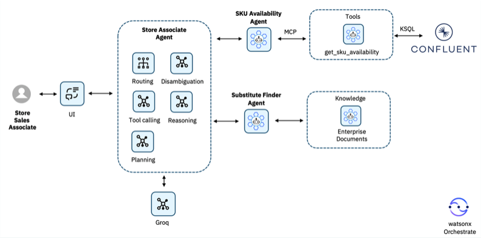
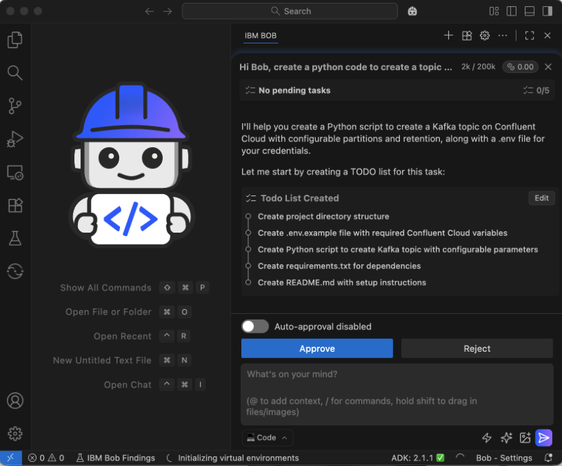
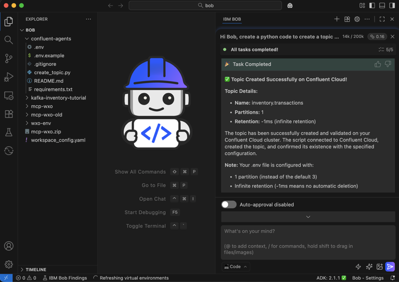
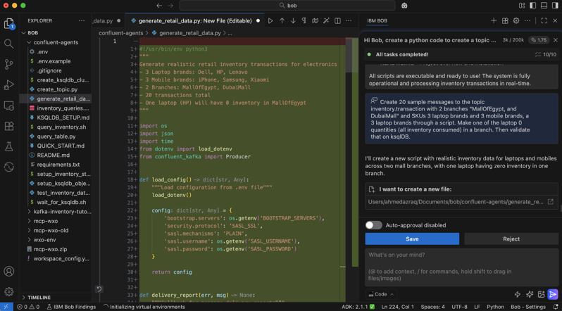
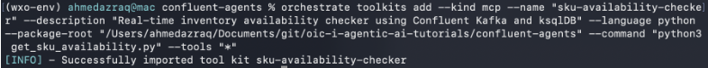
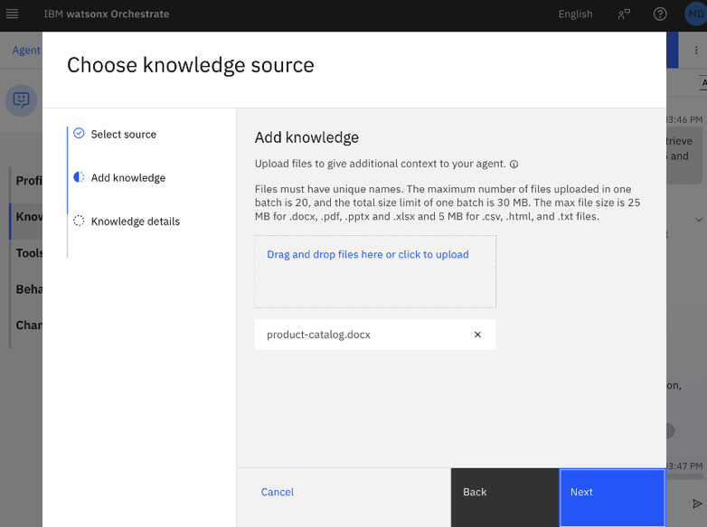
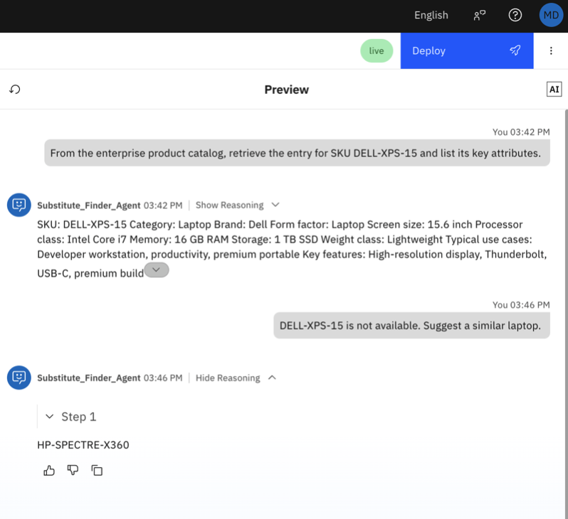
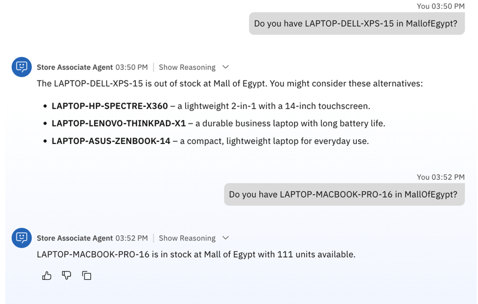

# Building an event-driven agentic AI system with Apache Kafka on Confluent Cloud and watsonx Orchestrate

Agentic systems must do more than answer individual questions. They need to observe environmental changes, reason over them, and update conclusions as conditions evolve in real time. These changes are represented as event streams (transactions, inventory updates, alerts, status changes), and traditional approaches like one-off inputs or periodic polling limit agent responsiveness.

This tutorial demonstrates how to build an event-driven agentic system using Confluent Cloud's managed Apache Kafka service and watsonx Orchestrate, where agents consume Kafka topic events as they arrive, analyze them in real time, and correlate them with business documents (policies, procedures, reference materials) to interpret live operational signals and explain their relevance. This pattern is particularly useful for monitoring operational issues, identifying emerging risks, or summarizing changes across complex systems where timing and context matter.

## Sample agentic AI system

In this tutorial, you will develop an agent on watsonx Orchestrate for a retail use case that performs the following:

Check stock availability in specific branch in real time for products by integrating with Confluent Kafka.

If stock is zero in a specific branch, recommend similar alternatives using agentic RAG by checking product description enterprise documents.

During high-demand seasons like the Christmas holidays, popular items sell out fast and availability changes minute-by-minute across branches. Customers (through store associates) constantly ask simple question like “Do you have the Laptop Dell XPS in the Mall of Egypt, and if not, what’s the alternative laptop?”

By the end of the tutorial, you will have a clear understanding of how event streaming fits into agent architectures and how watsonx Orchestrate can be used to reason over real-time data.

IBM Bob will serve as your AI software development partner, accelerating the process by helping you:

Create Kafka topics and a ksqlDB cluster on Confluent Cloud.
Publish sample events to the topic.
Build an MCP tool and AI agents on watsonx Orchestrate.
Use Agentic RAG to enrich Kafka events with enterprise documents.

## Architecture overview

The architecture consists of the following components:

1. Confluent Cloud (Kafka)

Hosts a source topic inventory.transactions containing JSON transaction events for stock increases and sales (negative quantities).

Hosts a derived topic inventory.availability that represents the current available quantity per SKU and branch.

2. ksqlDB (stream processing). Continuously reads inventory.transactions, aggregates by sku and branch, and writes the latest availability to inventory.availability.

3. Kafka availability tool (MCP toolkit). Exposes get_sku_availability (sku, branch) for querying the current availability derived from Kafka.

4. watsonx Orchestrate agents

- SKU_Availability_Agent calls the availability tool to check stock in a specific branch.
- Substitute_Finder_Agent uses enterprise product documents to recommend similar SKUs when the requested SKU is not available.
- Store_Associate_Agent is a supervisor agent that delegates to the two specialist agents and returns a single customer-friendly response.
Enterprise documents. A product catalog document (product-catalog.docx) is uploaded as an enterprise knowledge source (enterprise_documents) and used for semantic similarity search in the Substitute Finder Agent.

The following figure shows this architecture:



1. A Store Sales Associate asks a product availability question through the UI, for example:
“Do you have LAPTOP-DELL-XPS-15 in Mall Of Egypt?”

2. The request is handled by the Store Associate Agent, which acts as a supervisor agent. It parses the request, extracts the SKU and branch, and decides which specialist agents to call.

3. The Store Associate Agent delegates the inventory check to the SKU Availability Agent.

4. The SKU Availability Agent calls the get_sku_availability MCP tool, which queries the Kafka-derived availability state (inventory.availability) computed by ksqlDB from real-time inventory transactions in Confluent Cloud.

5. The SKU Availability Agent returns one of the following results to the Store Associate Agent:

- The SKU is available, including the current quantity at the requested branch.
- The SKU is tracked but currently out of stock.
- The SKU is not tracked in the inventory data.

6. If the SKU is available, the Store Associate Agent responds directly with the availability and quantity.

- If the SKU is not available (out of stock or not tracked), the Store Associate Agent delegates the request to the Substitute Finder Agent.

7. The Substitute Finder Agent performs semantic retrieval over enterprise product documents to identify similar SKUs based on product attributes such as category, form factor, processor class, and usage tier.

- It returns up to two or three suitable alternative products with short explanations.
- It combines the results into a single customer-facing response and returns it back to the Store Associate Agent.

8. The Store Associate Agent combines the results and returns it back to the user.

### Prerequisites

- This tutorial assumes you have a running local environment of watsonx Orchestrate Agent Development Kit (ADK). Check out the getting started with ADK tutorial (https://developer.ibm.com/tutorials/getting-started-with-watsonx-orchestrate/)if you don’t have an active instance. This tutorial has been tested on watsonx Orchestrate ADK version 2.11.

- Access to IBM Bob. Sign up for your free trial. https://bob.ibm.com/trial/?utm_source=developer-content&cm_sp=ibmdev-_-developer-_-trial 

- An instance of watsonx Orchestrate (https://www.ibm.com/docs/en/watsonx/watson-orchestrate/base?topic=orchestrate-accessing-trial-version&utm_source=ibm_developer&utm_content=in_content_link&utm_id=tutorials_event-driven-agentic-ai-system-confluent-watsonx-orchestrate&cm_sp=ibmdev-_-developer-tutorials-_-ibmcom).

- Basic familiarity with Kafka concepts such as topics and consumers.

## Step 1. Create a Kafka topic in Confluent Cloud

You can create the Kafka topic using Bob or you can manually create the files.

Create a Kafka topic using Bob

If you have access to Bob, you can ask Bob to create the topic for you using Python Code. Bob will ask you about your credentials and will proceed in creating the topic for you. For example, this is the instruction in natural language to ask Bob to perform the tasks:

```bash
Hi Bob, create a python code to create a topic on Confluent Cloud called "inventory.transactions", make the number of partitions and retention configurable, and create an .env file and I will fill it with my Confluent Cloud details and credentials. Create "bob/confluent-agents" as my working directory for the project. For this task configure 1 partition and infinte retention (-1ms)
```



### Creating a Kafka topic using Bob

Copy the .env file from *confluent-agents-solution* folder to your Bob's confluent-agents directory that was created by Bob. It contains all relevant credentials to an already configured Confluent Kafka cluster.

After you add your credentials, you can ask Bob to create the topic by asking Bob the following: 

```bash
I edited the .env file with my credentials, you can now create the topic on Confluent Kafka, and please validate that it's created successfully.
```



## Step 2. Publish sample message events to the topic

At this point, you have already had two topics (pre-created):

- inventory_transactions: Includes all the transactions (positive means additional stock, and negative means sales transaction).

- inventory_availability: This a derived topic that you created in the previous step to automatically calculate the availability.

The inventory.transactions topic exists but contains no messages. You need to publish sample messages to the topic.

### Publishing sample messages using Bob

You can use Python code created with the help of Bob to publish sample events to the topic. You can ask Bob to perform that through this instruction.

```bash
The inventory_transactions topic includes the following fields "sku, branch, quantity, transaction_type". Transaction Type can be either Addition for positive quantity through additional inventory or SALE for negative quantity through sales transaction from pos. Publish 20 sample messages to the topic inventory_transactions with 2 branches "Mall Of Egypt and Dubai Mall" and SKUs 3 laptop brands and 3 mobile brands, through a script. Make one of the laptop 0 quantities (all inventory consumed) in a branch.
```



## Step 3. Create API key and service URI for Watsonx Orchestrate

Navigate to IBM Cloud and sign in to your dedicated Watsonx Orchestrate demo environment.
https://cloud.ibm.com


Click on left pane on three lines (Resources menu)


Find and select your Watsonx Orchestrate service. 


You need this API key and instance url to deploy your new agent to your Watsonx Orchestrate environment. Please copy and save it to a secure location. Then click on blue Launch button


You are there. You are going to use this UI for building and testing agents. Keep it open in a browser tab.


## Step 4. Create the MCP tool and AI Agent in watsonx Orchestrate

In this step, you create the MCP tool and AI agent in watsonx Orchestrate. The MCP tool and AI agent configurations were created and validated with the help of IBM Bob.

Prompt Bob in the Code mode with the following: 

```bash
Create an MCP Server using the FastMCP framework. The MCP function is to query 
the current inventory (stored in a ksqlDB table in Confluent Cloud).

Requirements:
1. Use ksqlDB connection details from .env file
2. Implement ROBUST response parsing that handles multiple ksqlDB response formats:
   - Streaming format: {"row": {"columns": [...]}}
   - Direct format: {"sku": ..., "branch": ..., "available_quantity": ...}
   - Error responses: {"error_code": ..., "message": ...}
3. Use a multi-strategy parsing approach:
   - First try to parse response as JSON
   - If that fails, fall back to line-by-line text parsing
   - Include regex-based extraction as final fallback
4. The parsing logic should match the proven approach:
   - _extract_json_objects() function
   - parse_query_output() for text-based streaming
   - parse_ksqldb_response() for JSON responses
   - execute_ksqldb_query() that tries JSON first, then text parsing
5. Create comprehensive unit tests (30+ tests)
6. Use existing venv (../../.venv)
7. Name the file mcp_server.py
```

To import the MCP tool into watsonx Orchestrate, follow these steps: 

1. When launching your IBM Watsonx Orchestrate instance via IBM CLOUD (go to https://cloud.ibm.com, click on the hamburger menu, select Resource List and then look for watsonx Orchestrate under the AI/Machine Learning category), click on the icon at the top right (tipically a circular icon with initials inside). Then, click on "Settings" and select "API details". This allows you to copy the INSTANCE_URL which is required for the next CLI command to add your environment and ensure you can import the MCP server to watsonx Orchestrate via ADK.

```bash
orchestrate env add -n <YOUR_ENVIRONMENT_NAME_OF_CHOICE> -u <YOUR_INSTANCE_URL>
```
Example:
```bash
orchestrate env add -n WXOADK -u https://api.au-syd.watson-orchestrate.cloud.ibm.com/instances/71d3279d-52fb-4c48-9eff-c1190632fa45
```

2. Substitute your API key from step 3 and activate your Orchestrate environment by providing your API key just created as follows: 

```bash
orchestrate env activate <YOUR_ENVIRONMENT_NAME_PREVIOUSLY_SELECTED> --api-key
```
Example:
```bash
orchestrate env activate WXOADK --api-key qmLPOTKMjLtlMnv07N4L_p7ACG96lfwzKJ-RT-FrgDm
```

You will be prompted to enter the API key, so provide it and activate the environment.

3. Import the MCP server to watsonx Orchestrate.

In the following command, replace /Users/andrealongo/Desktop/git/Confluent_Bob_Lab/confluent-agents with the absolute path of your project.

```bash
orchestrate toolkits add --kind mcp --name "sku-availability-checker" --description "Real-time inventory availability checker using Confluent Kafka and ksqlDB" --language python --package-root "/Users/andrealongo/Desktop/git/Confluent_Bob_Lab/confluent-agents" --command "python3 mcp_server.py" --tools "*"
```



**
In case of an ERROR like you see below, please copy the whole output to Bob. There might be a small issue like requirements.txt missing. Bob is trying to fix it for you.**


Only in case of ERROR: Remove failed import
```bash
orchestrate toolkits remove --name "sku-availability-checker"
```

Only in case of ERROR: Import the MCP server to watsonx Orchestrate with same command like before (don't forget to change path)
```bash
orchestrate toolkits add --kind mcp --name "sku-availability-checker" --description "Real-time inventory availability checker using Confluent Kafka and ksqlDB" --language python --package-root "/Users/andrealongo/Desktop/git/Confluent_Bob_Lab/confluent-agents" --command "python3 mcp_server.py" --tools "*"
```

**
In case of above solution didn't help, please copy files from confluent-agents-solution folder to your Bob's folder and apply remove failed import, then do a new import.**

4. Open your Watsonx Orchestrate's environment in a browser. Now it's time to create a SKU_Availability_Agent which can leverage the MCP which we just imported to check the availability of products in a specific branch. 

Open watsonx Orchestrate UI, then go to "Manage agents", then click "Create agent", and select "Create from scratch". Give it a name (SKU_Availability_Agent) and a description (e.g., Inventory Management Assistant) and create it. In the agent configuration page, go to the "Toolset" section and select "Add tool". Then select "Local instance" and select the MCP we just imported and click on "Add to agent". Finally, in the "Behavior" section paste the following instructions: 

```bash
You are an intelligent inventory management assistant that helps users check real-time SKU availability across different retail branches. 

Your capabilities:
- Check inventory availability for specific SKUs
- Filter availability by branch location
- Provide current stock levels from the real-time ksqlDB inventory system 

When users ask about inventory or stock availability: 
1. Use the sku-availability-checker:get_sku_availability tool to query the current inventory
2. Present the results in a clear, user-friendly format
3. Highlight any out-of-stock items (quantity = 0)
4. If asked about a specific SKU or branch, filter the results accordingly
```

Test the agent with one of the following questions:

```bash
What are the available SKUs in Mall Of Egypt?
```
```bash
Do you have LAPTOP-DELL-XPS-15 in Mall Of Egypt?
```

## Step 6. Create the agentic RAG agent in watsonx Orchestrate

In this step, you create the Substitute Finder Agent, which is responsible for suggesting suitable product alternatives when a requested SKU is not available in a specific branch. Unlike the SKU Availability Agent, which relies on real-time Kafka state, this agent reasons over enterprise product documents using agentic RAG.

The purpose of this step is to demonstrate how an agent can combine semantic understanding of product specifications with structured reasoning, instead of relying on static rules or hard-coded mappings.

The Substitute Finder Agent performs the following actions:

Reads product specifications and descriptions from enterprise documents.
Understands the characteristics of a requested SKU (category, tier, form factor, key features).
Finds similar products using semantic similarity search.
Returns 2–3 substitute SKUs with a short explanation of why they are good alternatives.
This agent does not directly interact with Kafka. Inventory availability is handled by the SKU Availability Agent in the previous step.

Create the Substitute Finder Agent:

The Substitute Finder Agent is defined in a YAML file provided in the Git repository in the "assets" folder.

1. Download the agent definition file and copy it to the Bob's confluent-agents folder, Substitute_Finder_Agent.yaml

2. Import the agent into watsonx Orchestrate using the Agent Development Kit (ADK):

```bash
cd assets
orchestrate agents import -f Substitute_Finder_Agent.yaml
```

3. After the import completes, deploy the agent so it becomes active. Click the Deploy button and then deploy again in the Pre-deployment summary window.

At this point, the agent is created and deployed, but it does not yet have access to enterprise documents. In the next step, you attach the product catalog as its knowledge source.

### Upload the product catalog to watsonx Orchestrate

The product catalog is provided in the github repository as product-catalog.docx in the "assets" folder.

This tutorial uses a single Word document that represents an internal product catalog. The document contains multiple product entries in a consistent format, which makes it suitable for semantic search and similarity matching.

The catalog includes sample products for this step like: LAPTOP-DELL-XPS-15 and LAPTOP-HP-SPECTRE-X360 and more. These products intentionally share several attributes, such as category, processor class, memory, storage, and usage tier. This overlap allows the agent to identify them as suitable substitutes through semantic similarity.

To upload the catalog:

1. Open the watsonx Orchestrate UI.

2. Navigate to the section for managing enterprise documents or knowledge sources.

3. Add a New Knowledge.

4. Click Upload Files.

5. Select the product-catalog file.
 


6. Click Next.

7. Set the name to enterprise_documents and add a description.

8. Click Save.

Wait until indexing completes and confirm the document is available for semantic search.

#### Test the agent in the watsonx Orchestrate UI

Test the agent in isolation before integrating it with the supervisor agent in the next step.

Prompt 1 – Grounding test

```bash
From the enterprise product catalog, retrieve the entry for SKU LAPTOP-DELL-XPS-15 and list its key attributes.
```
Expected result: The agent retrieves the catalog entry and lists the attributes defined in the document, without asking follow-up or confirmation questions.

Prompt 2 – Similarity test

```bash
LAPTOP-DELL-XPS-15 is not available. Suggest a similar laptop using the product catalog.
```

Expected result: The agent recommends HP-SPECTRE-X360 and explains the recommendation using shared attributes from the catalog.



## Step 7. Create the supervisor agent on watsonx Orchestrate

In this step, you create a Store Associate Agent that acts as a supervisor agent. Its role is to coordinate the previously created agents and provide a single, customer-facing interaction point for store associates.

This agent does not directly interact with Kafka or enterprise documents. Instead, it delegates tasks to specialized agents based on the user’s request and combines their responses into a clear, customer-friendly answer.

The Store Associate Agent is responsible for:

- Understanding the store associate’s question.
- Delegating inventory checks to the SKU Availability Agent.
- Delegating alternative recommendations to the Substitute Finder Agent when needed.
- Presenting a final, concise response suitable for customer interaction.
- This pattern demonstrates how agent orchestration works in watsonx Orchestrate, where a supervisor agent coordinates multiple domain-specific agents.

The Store Associate Agent follows this logic:

1. Receive a user question about product availability in a specific branch

2. Delegate the request to the SKU Availability Agent

3. If the requested SKU is available:

- Return availability and quantity
4. If the requested SKU is not available:

- Delegate to the Substitute Finder Agent

- Return recommended alternatives with short explanations

Branch-to-branch searching is intentionally excluded from this tutorial and can be added later as an extension.

### Create the Store Associate Agent

The Store Associate Agent is defined using a YAML configuration file provided in the repository.

1. Download the agent definition file and copy it to the Bob's confluent-agents folder, Store_Associate_Agent.yaml, in the "assets" folder of the repository.

2. Import the agent using the Agent Development Kit.

```bash
cd assets
orchestrate agents import -f Store_Associate_Agent.yaml
```

3. After the import completes, deploy the agent so it becomes active. Click the Deploy button.

In the Pre-deployment summary window, click Deploy again.

### Test the agent

Test A (Out of stock + substitutes)

```bash
Do you have LAPTOP-DELL-XPS-15 in Mall Of Egypt?
```

Test B (In stock example)

```bash
Do you have MOBILE-IPHONE-15PRO in Mall Of Egypt?
```



#### Summary and next steps

In this tutorial, you learned how to build an event-driven agentic AI system using Confluent Cloud and watsonx Orchestrate. By consuming Kafka events and correlating them with document context, the agent can reason over live operational signals and explain their significance. This approach enables more responsive and context-aware AI systems while keeping reasoning transparent and controlled.

Where IBM Bob was used, it played a key role in streamlining the development experience throughout this tutorial. By converting natural‑language instructions into fully functioning code, tool configurations, and validated agent behaviors, Bob accelerated each stage of the workflow, from creating Kafka topics and ksqlDB clusters to generating MCP tool definitions and agent YAML files. This allowed the development team to focus on architecture, reasoning patterns, and event‑driven design rather than low‑level setup tasks, demonstrating how AI‑assisted software engineering can dramatically improve productivity and consistency.
