# Environment Setup Instructions

> Step-by-step guide to install the watsonx Orchestrate ADK, configure the wxO MCP servers in IBM Bob, and connect the ADK to your watsonx Orchestrate environment.

---

## Table of Contents

1. [Getting your wxO ADK installed](#1-getting-your-wxo-adk-installed)
2. [Configuring the wxO MCP servers for Bob](#2-configuring-the-wxo-mcp-servers-for-bob)
3. [Configuring the wxO Mode for Bob](#3-configuring-the-wxo-mode-for-bob)
4. [Connecting the ADK to your wxO environment](#4-connecting-the-adk-to-your-wxo-environment)
5. [Option 2: Connect to wxO SaaS (IBM Cloud)](#5-option-2-connect-to-wxo-saas-ibm-cloud)

---

## 1. Getting your wxO ADK installed

### Step 1 — Open a new workspace

- Open **New Window** within IBM Bob IDE (**File → New Window**) to start from a clean workspace.
- **Create** and **Open** a new folder for your project (name it properly — the example below uses `environment-setup`).


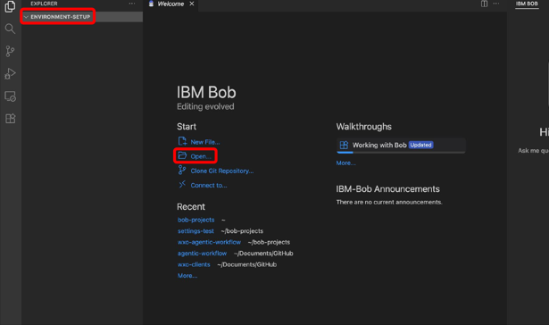

---

### Step 2 — Create a Python virtual environment

- Click the **search bar** at the top and select **Show and Run Commands**.
- Type `create` and select **Python: Create Environment…**
- Select **Venv** if given some options (depends on what you have installed to your computer).
- Select your **Python installation — 3.11.x – 3.13.x** (3.12.9 recommended).
- The Python virtual environment will be installed and you will see the **`.venv`** folder under your project folder in a couple of seconds.

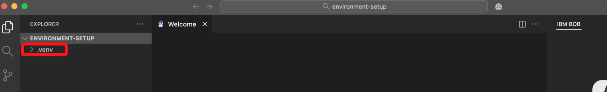

---

### Step 3 — Install the watsonx Orchestrate ADK extension

- Click the **Extensions** icon from the menu bar on the left, search for **`watsonx`** and click **Install** on the watsonx Orchestrate ADK extension.

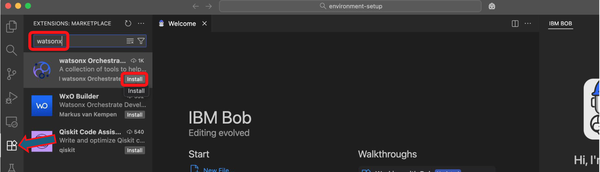

- This will install the extension (note that the extension is still in **preview**).

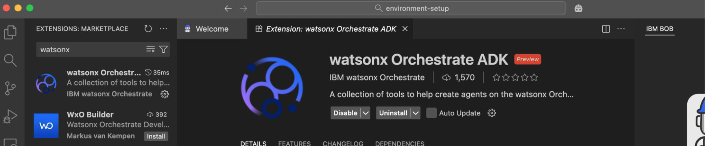

---

### Step 4 — Install the ADK into your virtual environment

- Now that you have the wxO ADK extension installed, you can see the ADK information on the **bottom right** of the Bob IDE window. Look for the **ADK: X** indicator in the status bar.

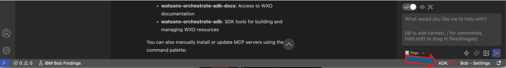

- Click the **ADK: X** area — this will open the search bar with two options, select **"Install Orchestrate ADK"**.

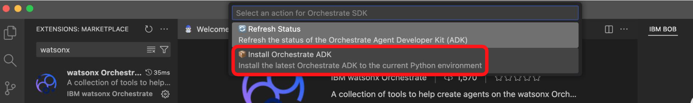

- After a while you will see the latest ADK version installed to your active Python virtual environment.

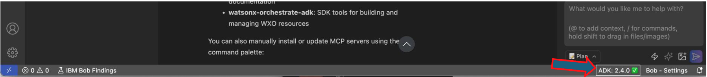

> **Next:** Let's configure the wxO MCP servers for Bob!

---

## 2. Configuring the wxO MCP servers for Bob

IBM watsonx Orchestrate (wxO) provides two different MCP servers that you can add to IBM Bob's "knowledge":

| Server | Purpose |
|---|---|
| **wxo-docs** | Documentation server — Bob learns how to create agents, tools, connections, etc. with wxO |
| **orchestrate-adk** | Operations server — import/export agents and tools, run configuration changes, etc. |

These servers are configured by editing Bob's `mcp.json` files directly — no IBM network connection or marketplace access needed.

---

### Step 1 — Enable MCP servers in Bob settings

- Open the **IBM Bob** side panel if not already open by clicking the Bob icon next to the search bar.
- Then click the **settings icon** to access all the IBM Bob IDE settings.

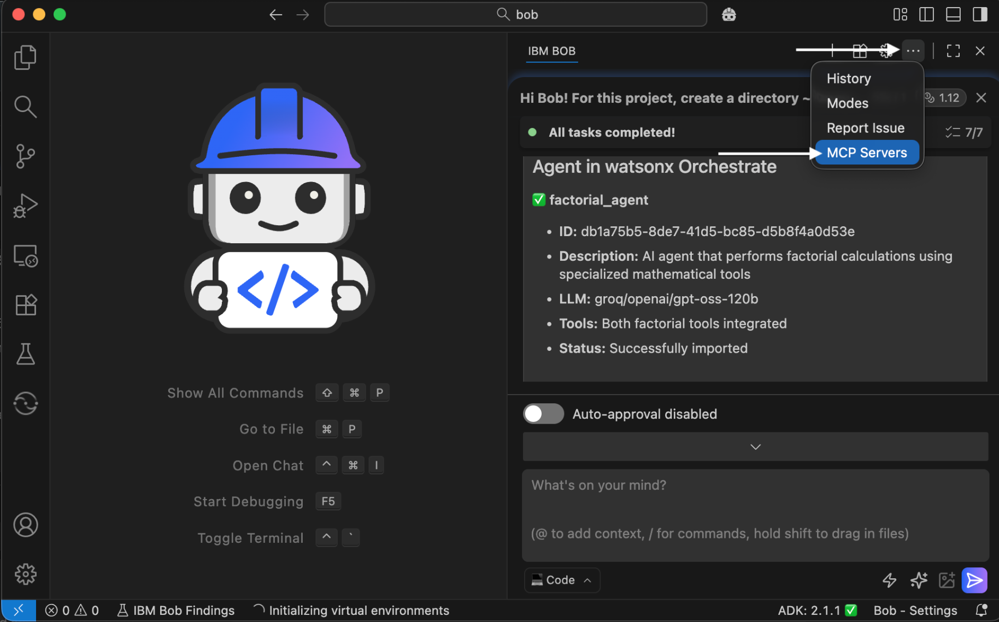

- Select the **MCP** category and make sure you have both **Use MCP Servers** and **Enable MCP Server Creation** toggles enabled.

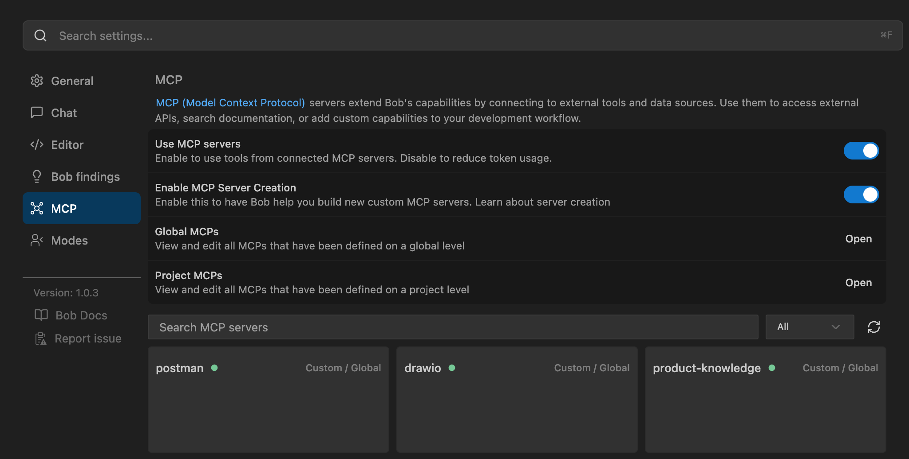

---

### Step 2 — Add the documentation server (Global MCP)

In Bob's MCP panel, click **Open Global MCPs** anddd the following configuration to configure the connection to the watsonx Orchestrate MCP server that has access to the documentation and then save the file. Then save the file:

```json
{
  "mcpServers": {
    "watsonx-orchestrate-adk-docs": {
      "type": "streamable-http",
      "url": "https://developer.watson-orchestrate.ibm.com/mcp"
    },
    "watsonx-orchestrate-adk": {
      "command": "uvx",
      "args": [
        "ibm-watsonx-orchestrate-mcp-server"
      ],
      "env": {
        "WXO_MCP_WORKING_DIRECTORY": "",
        "WXO_MCP_DEBUG": ""
      },
      "timeout": 300
    }
  }
}
```

### Step 3 — Confirm MCP server is connected

After saving both files, go back to the MCP settings view and search for `wxo` — you should see both servers listed as connected.

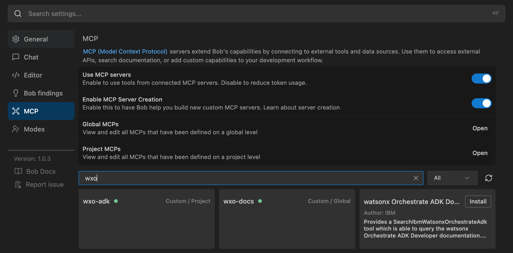

> *One more thing to do:* add a new wxO Agent Architect mode to Bob, so that it can make use of the MCP servers.

---

## 3. Configuring the wxO Mode for Bob

Now that you have the wxO MCP servers available, create a new mode for Bob so you can select when you want Bob to use the servers.

- Switch to the **Modes** view in the Bob settings
- Click **Open Global Modes** and add the following configuration:


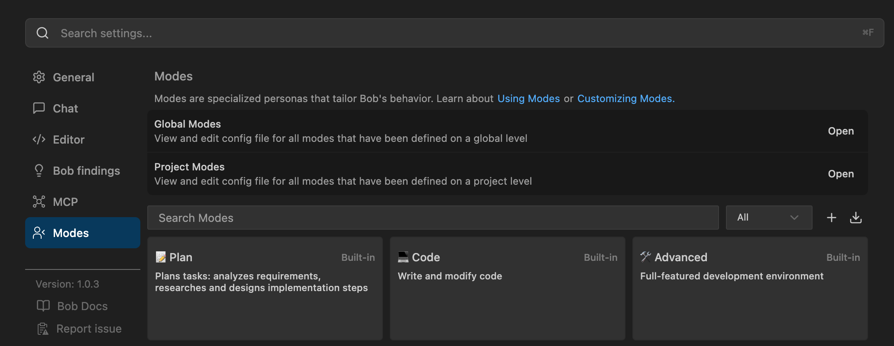


```json
customModes:
   - slug: agent-architect
     name: Agent Architect
     roleDefinition: You are Bob, a highly skilled software engineer with extensive knowledge in many programming languages, frameworks, design patterns, and best practices. You are especially skilled at building new agents for watsonx Orchestrate.
     customInstructions: |-
       Before solving any tasks related to the watsonx orchestrate platform use the wxo-docs mcp server's SearchIbmWatsonxOrchestrateAdk tool  to better understand how to author agents, tools, toolkits, models, knowledge_bases and connections for wxo.

       When authoring an agent, use the wxo-adk mcp server list_tools comand to find tools which may be relevant to the problem and list_agents tool to find relevant collaborator agents.

       If you need to extract information from the watsonx Orchestrate
       platform use the orchestrate-adk mcp server.

       Never include ibm-watsonx-orchestrate in your requirements.txt
     groups:
       - read
       - edit
       - browser
       - command
       - mcp
     source: global
```

In the right panel, scroll to the bottom, click **Code** and then select **Agent Architect** mode to start working with watsonx Orchestrate.


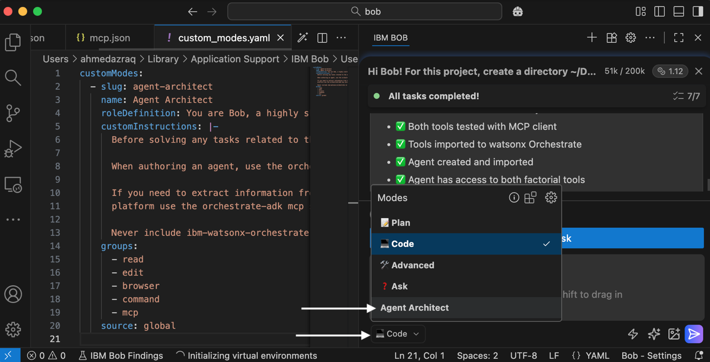


> **Next:** Let's connect your ADK to the wxO environment you want to use!

---

## 4. Connecting the ADK to your wxO environment

You have **two options** for connecting the ADK to a wxO environment:

| Option | Description | Requirements |
|---|---|---|
| **Option 1** | Install wxO runtime — **Developer Edition** — locally | Min. 16 GB RAM (32 GB recommended) |
| **Option 2** | Use an **existing wxO environment** (e.g., IBM Cloud SaaS) | Active IBM Cloud wxO instance |

The next section covers **Option 2** (IBM Cloud SaaS).

---

## 5. Option 2: Connect to wxO SaaS (IBM Cloud)

### Step 1 — Ask Bob to create the environment connection

Instead of running wxO locally, you can use an existing wxO environment and connect your ADK to it. If you already have the wxO MCP servers configured for Bob:

1. Make sure you have the **Agent Architect** selected (the mode that allows Bob to use the wxO MCP servers).
2. In the Bob chat, type:

   > *"I want to add a new orchestrate environment (IBM Cloud) to my ADK and I want to activate the environment separately"*

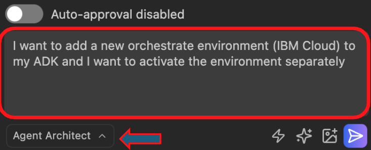

3. Bob will ask for access to the **wxo-docs** MCP server — click **Approve**.

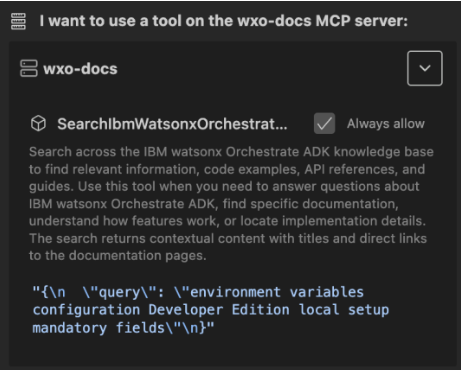

4. Bob may ask if you already have the instance URL and API key — select the answer that you **still need to get them from IBM Cloud**.

---

### Step 2 — Review Bob's generated instructions

- Bob will ask permission to create/write a new file — give the permission (**Save**).
- Bob will then summarize the task for you (task completed), including the key commands you need to run.
- Bob will also open the `.md` file it created for you — these are the instructions you can follow to add the wxO environment from IBM Cloud.

---

### Step 3 — Find your wxO instance URL

1. **Log in** to the IBM Cloud account you should have been invited to (the account where your wxO environment was provisioned or where your instructors added you).
2. Select **Resources list** from the menu bar on the left.

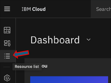

3. Open the collapsible menu for **AI / Machine Learning** and then click on the **Watson Orchestrate-itz** service to open it.

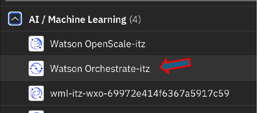

---

### Step 3 — Copy the service URL and navigate to Access (IAM)

- **Copy the service URL** from the **Credentials** panel and store it so you can easily access it in the next steps.

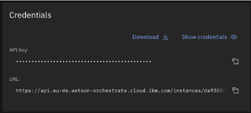

- Unfortunately the default API key is not working for this ITZ environment as it should — you need to create your own API key.
- Open the **Manage** menu from your IBM Cloud page and select **Access (IAM)**.

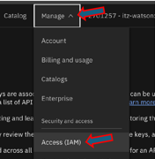

---

### Step 4 — Navigate to API keys and click Create

- Select **API keys** from the menu on the left (under the **Manage identities** section).

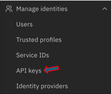

- Click **Create** while "My IBM Cloud API keys" is selected for the view.

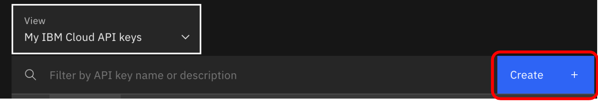

---

### Step 5 — Name and save your API key

- Name the API key as you wish (e.g., `wxo-apikey`), keep the default settings and click **Create**.

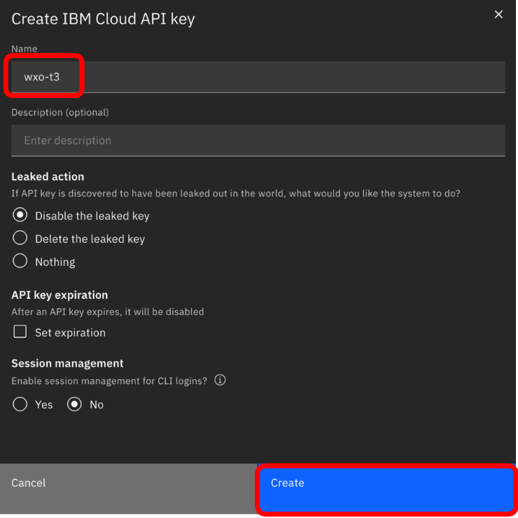

- **Copy the API key value** and store it so you can access it easily in the next steps — you will **not** be able to see it again once you close this dialog.

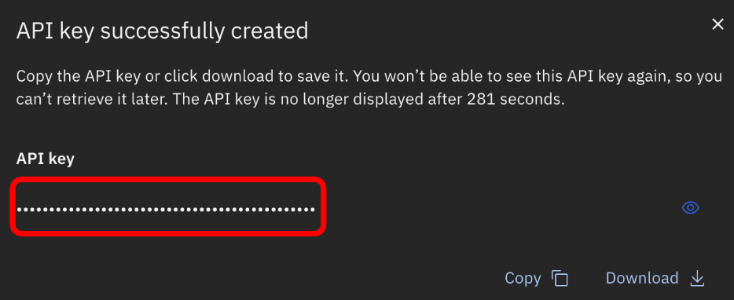

---

### Step 6 — Add the new environment to your ADK

Open a terminal in Bob IDE: **Terminal → New Terminal** (from the IBM Bob main menu bar).

Run the command below, replacing the placeholders with your values:

```bash
orchestrate env add -n <environment-name> -u <service-instance-url> --type ibm_iam
```

| Placeholder | Replace with |
|---|---|
| `<environment-name>` | A name for your environment, e.g. `hungarybob` |
| `<service-instance-url>` | The URL you copied from the IBM Cloud wxO service page |

![Terminal showing the full orchestrate env add command with a real service URL, and the "[INFO] – Environment 'hungarybob' has been created" confirmation](images/screenshots/p22-terminal-env-add.png)

---

### Step 7 — Activate the environment

Run the following command:

```bash
orchestrate env activate <environment-name>
```

When prompted, **paste your API key** and press Enter to confirm. You will see a confirmation that the environment is now active.

![Terminal showing "orchestrate env activate hungarybob", the "Please enter WXO API key:" prompt, and the "[INFO] – Environment 'hungarybob' is now active" confirmation](images/screenshots/p23-terminal-env-activate.png)

---

### ✅ You are now good to go with the lab exercises!
